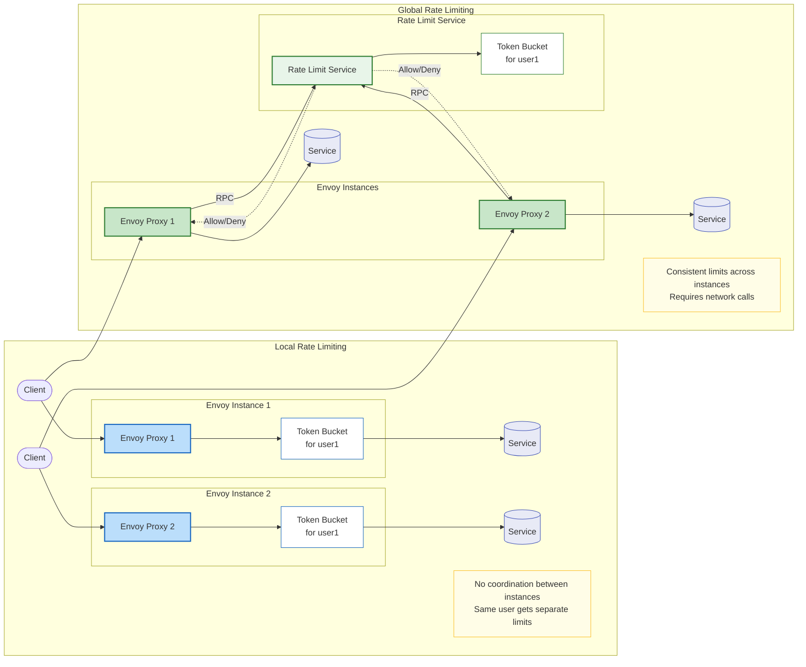
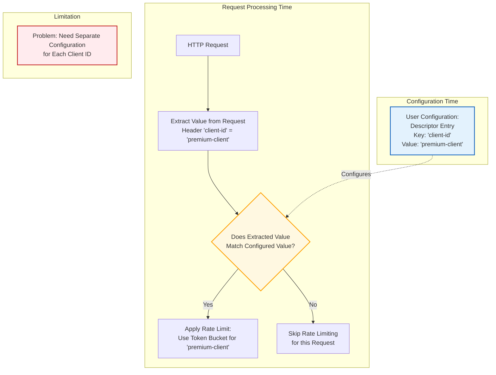
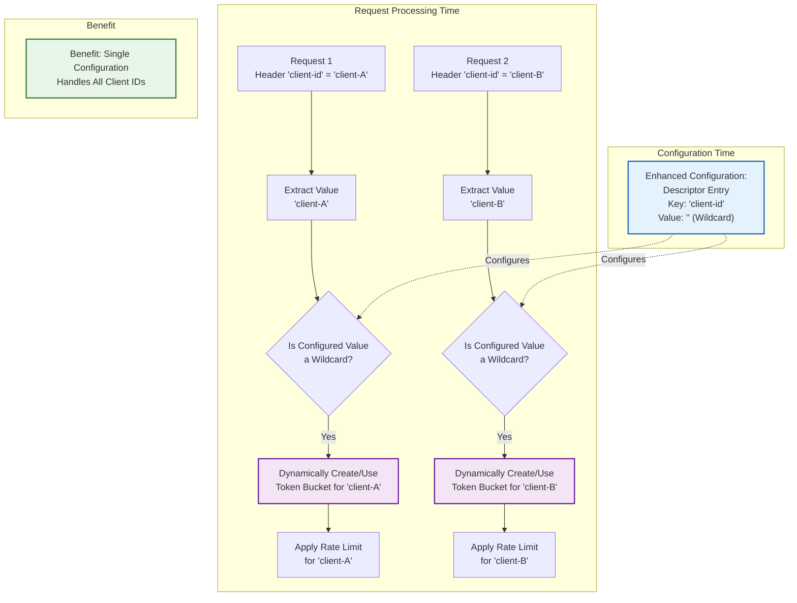

## Introduction

Envoy Proxy has long offered powerful rate limiting capabilities to protect services from traffic spikes and ensure fair resource allocation. However, until recently, there was a significant limitation in how users could configure local rate limiting descriptors.

While Envoy allowed flexible extraction of values from HTTP requests at runtime based on user configuration, the descriptors that defined rate limiting rules required static, pre-defined values. This meant that to implement per-entity rate limiting (such as per-user, per-client, per-IP, etc.), you would either need to:

1. Configure an external rate limiting service (implementing [global rate limiting](https://www.envoyproxy.io/docs/envoy/latest/intro/arch_overview/other_features/global_rate_limiting.html), which adds latency and complexity), or
2. Use [local rate limiting](https://www.envoyproxy.io/docs/envoy/latest/intro/arch_overview/other_features/local_rate_limiting#arch-overview-local-rate-limit) and statically define every possible identifier value in your configuration (impractical for dynamic environments)

This gap between flexible value(http request properties) extraction and rigid descriptor definition was especially problematic for platform teams trying to implement fair usage policies across different request attributes without adding external dependencies.

I recently contributed [an enhancement](https://github.com/envoyproxy/envoy/pull/36623) to Envoy Proxy that addresses this limitation by allowing wildcard values in rate limit descriptor entries. This change enables dynamic creation of token buckets based on unique values extracted from requests, such as user identifiers, client IDs, API keys, or any other request property, without requiring an external rate limit service. It was a long-requested capability from both major Envoy users and the wider community (see GitHub issues [#23351](https://github.com/envoyproxy/envoy/issues/23351) and [#19895](https://github.com/envoyproxy/envoy/issues/19895)).

In this blog post, I'll explain how this feature works, show configuration examples, and demonstrate practical applications for request-scoped rate limiting.

## Local vs Global Rate Limiting in Envoy

Before diving into the enhancement details, it's important to understand the two approaches to rate limiting in Envoy:



### Local Rate Limiting

- Rate limits are applied independently on each Envoy instance
- No network calls or external dependencies
- Lower latency and higher reliability
- Ideal for per-instance protection and simple use cases
- Prior to this enhancement, could only rate limit against statically defined values

### Global Rate Limiting

- Relies on an external rate limiting service
- Consistent rate limiting across all Envoy instances
- Requires network calls, adding latency and potential points of failure
- Necessary for cluster-wide coordinated rate limiting
- More flexible but with higher operational complexity

The dynamic descriptor enhancement I contributed focuses on improving local rate limiting, making it almost as flexible as global rate limiting but without the operational complexity.

## Background on Envoy Rate Limiting

Before diving into the enhancement, let's briefly understand how Envoy's local rate limiting traditionally worked.

Envoy's rate limiting is configured through descriptors which contain entries with key-value pairs. These descriptors define the conditions under which rate limiting is applied. When a request comes in, Envoy extracts values from the request (such as headers, path, or method) and checks if they match the configured descriptor entries.

For example, if you wanted to rate limit requests from a specific client:

```yaml
descriptors:
- entries:
  - key: "client-id"
    value: "premium-client"
  token_bucket:
    max_tokens: 100
    tokens_per_fill: 100
    fill_interval: 60s
```

This configuration would only apply rate limiting to requests where the `client-id` header equals `premium-client`. If you wanted to rate limit multiple clients differently, you would need separate descriptor entries for each client ID:

```yaml
descriptors:
- entries:
  - key: "client-id"
    value: "premium-client"
  token_bucket:
    max_tokens: 100
    tokens_per_fill: 100
    fill_interval: 60s
- entries:
  - key: "client-id"
    value: "standard-client"
  token_bucket:
    max_tokens: 50
    tokens_per_fill: 50
    fill_interval: 60s
```

This approach becomes unwieldy when you have many clients or when client identifiers are not known in advance.

For more detailed information on Envoy's rate limiting API, you can refer to the [official documentation](https://www.envoyproxy.io/docs/envoy/latest/api-v3/extensions/common/ratelimit/v3/ratelimit.proto).

### Traditional Rate Limiting Flow



In the traditional approach, each configured descriptor entry requires an exact match for the value. This means you need to know all possible values ahead of time and configure them explicitly.

## The Enhancement: Dynamic Descriptor Entries

The enhancement I contributed allows users to leave the `value` field blank in descriptor entries, which functions as a "wildcard". This means Envoy will dynamically create and manage separate token buckets for each unique value it encounters at runtime.

Here's how the configuration looks with this enhancement:

```yaml
descriptors:
- entries:
  - key: "client-id"
    value: "" # Wildcard - matches any value
  token_bucket:
    max_tokens: 100
    tokens_per_fill: 100
    fill_interval: 60s
```

With this single configuration, if Envoy receives requests with `client-id` headers containing "client-A", "client-B", and "client-C", it will automatically create three separate token buckets and apply rate limiting independently to each client.

### Enhanced Dynamic Rate Limiting Flow



The enhanced approach creates token buckets dynamically based on the unique values, for the keys specified by user in configuration,  extracted from incoming requests. A single configuration can now handle any number of unique values.

This approach offers several advantages:
1. Simplified configuration - no need to list every possible value
2. Future-proof - automatically handles new client IDs without reconfiguration
3. No external dependencies - all rate limiting happens locally in Envoy
4. Fine-grained control - each unique value gets its own rate limit

## Implementation Details

The key challenge in implementing this enhancement was ensuring that dynamically created descriptors wouldn't consume unlimited resources. To address this, I implemented an LRU (Least Recently Used) cache mechanism to manage the dynamic descriptors.

### LRU Cache for Dynamic Descriptors

When Envoy encounters a request with a new unique value for a wildcard descriptor entry:

1. It creates a new token bucket for this value
2. It adds this descriptor to the LRU cache
3. If the cache reaches its capacity limit, the least recently used descriptor is evicted

The default cache size is set to 20 entries, which is a conservative value suitable for testing. However, in production environments with high request rates and many unique values, this limit might need to be increased to prevent premature eviction.

When a descriptor is evicted and then encountered again, Envoy will create a new token bucket, effectively resetting the rate limit for that value. This could lead to unexpected behavior where some clients get more requests than intended if the cache size is too small relative to the number of unique values.

### Configuration Example

Here's how you can configure the cache size, `max_dynamic_descriptors`:

```yaml
route_config:
  name: local_route
  virtual_hosts:
  - name: local_service
    domains: ["*"]
    routes:
    - match: {prefix: "/foo"}
      route:
        cluster: service_protected_by_rate_limit
        rate_limits:
        - actions:  # any actions in here
          - request_headers:
              header_name: x-envoy-downstream-service-cluster
              descriptor_key: client_cluster
          - request_headers:
              header_name: ":path"
              descriptor_key: path
      typed_per_filter_config:
        envoy.filters.http.local_ratelimit:
          "@type": type.googleapis.com/envoy.extensions.filters.http.local_ratelimit.v3.LocalRateLimit
          max_dynamic_descriptors: 10000
          stat_prefix: test
          token_bucket:
            max_tokens: 1000
            tokens_per_fill: 1000
            fill_interval: 60s
          filter_enabled:
            runtime_key: test_enabled
            default_value:
              numerator: 100
              denominator: HUNDRED
          descriptors:
          - entries:
            - key: client_cluster
              value: foo
            - key: path
              value: /foo/bar
            token_bucket:
              max_tokens: 10
              tokens_per_fill: 10
              fill_interval: 60s
          - entries:
            - key: client_cluster
              value: foo
            - key: path
              value: /foo/bar2
            token_bucket:
              max_tokens: 100
              tokens_per_fill: 100
              fill_interval: 60s
```

### Real-World Adoption

It's worth noting that Envoy Gateway, a control plane that uses Envoy Proxy as its data plane, has already [adopted this feature](https://github.com/envoyproxy/gateway/pull/5319) with a default cache size of 10,000 entries. This larger default acknowledges the practical needs of production environments with many unique clients.

## Usage Examples

Let's explore some real-world scenarios where this enhancement shines:

### Per-User API Rate Limiting

Limit each user to 100 requests per minute based on a user ID header:

```yaml
max_dynamic_descriptors: 10000
descriptors:
- entries:
  - key: "user-id"
    value: "" # Wildcard - matches any user
  token_bucket:
    max_tokens: 100
    tokens_per_fill: 100
    fill_interval: 60s
```

### Tiered Rate Limiting with Path Differentiation

Apply different rate limits based on the API path for each client:

```yaml
max_dynamic_descriptors: 10000
descriptors:
- entries:
  - key: "client-id"
    value: "" # Wildcard - matches any client
  - key: "path"
    value: "/api/v1/critical" # Specific path
  token_bucket:
    max_tokens: 10
    tokens_per_fill: 10
    fill_interval: 60s
- entries:
  - key: "client-id"
    value: "" # Wildcard - matches any client
  - key: "path"
    value: "/api/v1/standard" # Different path
  token_bucket:
    max_tokens: 100
    tokens_per_fill: 100
    fill_interval: 60s
```

This configuration creates separate rate limits for each client accessing each path, without requiring you to know the client IDs in advance.

### IP-Based Rate Limiting

Protect your services from potential abuse by limiting requests per IP address:

```yaml
max_dynamic_descriptors: 20000
descriptors:
- entries:
  - key: "remote_address"
    value: "" # Wildcard - matches any IP
  token_bucket:
    max_tokens: 50
    tokens_per_fill: 50
    fill_interval: 60s
```

## Performance Considerations

The implementation is designed to be efficient, with the LRU cache mechanism providing a good balance between flexibility and resource usage. However, there are a few considerations to keep in mind:

1. **Memory Usage**: Each dynamic descriptor consumes memory. Set the `max_entries` appropriately for your environment.
2. **Eviction Behavior**: If a descriptor is evicted and then re-encountered, its rate limit counter effectively resets. Size your cache appropriately to minimize unwanted evictions.

## Conclusion

The addition of dynamic descriptor entries to Envoy's local rate limiting capabilities represents a significant enhancement to Envoy's traffic management toolkit. By allowing wildcard values in descriptor entries, we've simplified configuration while making it possible to apply fine-grained rate limits based on any request attribute without prior knowledge of all possible values.

This feature has been a long-requested capability in the Envoy community, and I'm pleased to see it already being adopted in projects like Envoy Gateway. By enabling dynamic per-entity rate limiting without external dependencies, we've made it easier for service owners to implement fair usage policies and protect their services from excessive traffic.

This enhancement is particularly valuable for the numerous control plane projects that use Envoy as their data plane, including Istio, Contour, Emissary, and Envoy Gateway. These projects can now provide their users with more flexible rate limiting options without requiring external rate limiting services.

## Next Steps

If you're interested in using this feature:

1. Ensure you're running a version of Envoy that includes this enhancement (post-February 2024)
2. Update your local rate limit filter configurations to use empty values for descriptor entries where you want dynamic behavior
3. Configure appropriate `max_dynamic_descriptors` values based on your expected number of unique values
4. Monitor memory usage and adjust as needed

If you're a maintainer or user of a control plane that uses Envoy as its data path, I encourage you to explore this feature and consider how it might simplify your rate limiting strategies.

Feedback and contributions are always welcome!!!!.
